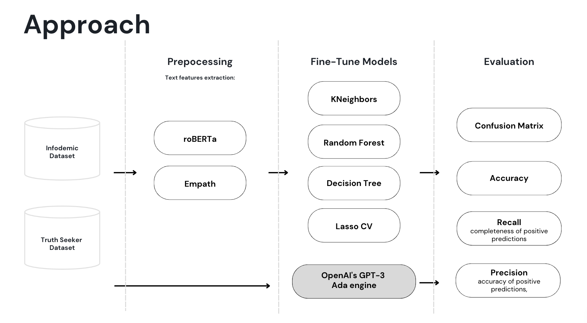

# AWESOME-misinformation-detection

As part of our Data Science & AI specialisation we chose to tackle the problem of fake news on twitter. We found to public datasets with labelled tweets and applied different classification algorithms.

## Infodemic Dataset 

The first dataset we used was taken from a paper called [Fighting an Infodemic](https://arxiv.org/abs/2011.03327). The authors manually annotated a dataset of 10,700 social media posts and articles of real and fake news on COVID-19.

- Springer Link: https://link.springer.com/chapter/10.1007/978-3-030-73696-5_3
- Dataset: https://competitions.codalab.org/competitions/26655
- Link to Competition: https://constraint-shared-task-2021.github.io/
- Other GitHub projects: 
  - https://github.com/diptamath/covid_fake_news
  - https://github.com/parthpatwa/covid19-fake-news-dectection

## TruthSeeker Dataset

The second dataset is one of the most extensive benchmark datasets with more than 180.000 labels from 2009 to 2022 from a paper called [TruthSeeker: The Largest Social Media Ground-Truth Dataset for Real/Fake Content](https://www.techrxiv.org/articles/preprint/TruthSeeker_The_Largest_Social_Media_Ground-Truth_Dataset_for_Real_Fake_Content/22795130/1).  

- Dataset: https://www.unb.ca/cic/datasets/truthseeker-2023.html

## Models Implemented and 

## Summary

- The OpenAI model outperformed all other models, however the model is lacking explainability
- Classical models:
  - the best approach for analysing text was found to be a combination of semantic features, Twitter metadata, and sentiment analysis
- Assessing the models generalizability:
  - the classic models are demonstrating higher effectiveness across different datasets
  - potential better suited for real-world applicability

## Further Resources:
- https://predictivehacks.com/how-to-fine-tune-an-nlp-classification-model-with-openai/
- https://www.datacamp.com/tutorial/fine-tuning-gpt-3-using-the-open-ai-api-and-python
- https://lovespreadsheets.medium.com/how-to-classify-open-ended-text-using-ai-python-17b9bed62e1d
- https://towardsdatascience.com/building-a-fake-news-classifier-using-natural-language-processing-83d911b237e1
